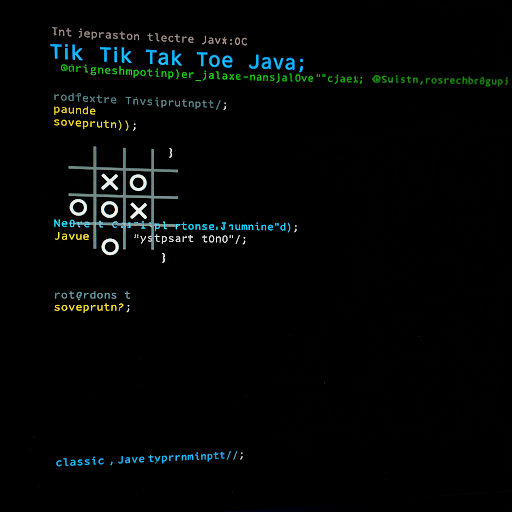

# Tik Tak Toe Java

<div align="center">


<div data-badges>
 
 
 
 

</div>

<div data-badges>
 
</div>

</div> 

Este projeto implementa o clássico jogo da velha em Java, com uma interface simples e interativa no console. Permite que dois jogadores se alternem para marcar suas jogadas em um tabuleiro 3x3, com o objetivo de alinhar três símbolos iguais (X ou O) na horizontal, vertical ou diagonal.

## Funcionalidades:

- Interface de console: O jogo é executado diretamente no terminal, sem necessidade de interface gráfica.
- Jogabilidade para dois jogadores: Dois jogadores podem jogar entre si, alternando seus turnos.
- Tabuleiro 3x3: O tabuleiro é representado por uma matriz 3x3, exibida no console.
- Marcação de jogadas: Os jogadores inserem as coordenadas da posição desejada para marcar suas jogadas.
- Verificação de vitória: O jogo verifica automaticamente se algum jogador atingiu a condição de vitória.
- Verificação de empate: O jogo também verifica se houve empate, caso todas as posições sejam preenchidas sem vencedor.
- Mensagens informativas: O jogo exibe mensagens claras e informativas para orientar os jogadores durante a partida.

## Contribuição:

Contribuições são bem-vindas! Se você tiver ideias para melhorias ou correções de bugs, sinta-se à vontade para abrir uma issue ou enviar um pull request.

## Como rodar esse projeto

## Requisitos

Java Development Kit (JDK) instalado

### Execução

1. Clone esse repositório

    ```sh
    git clone https://github.com/Pablo-Sts/tik-tak-toe_java
    ```

2. Acesse o diretório do projeto: 

    ```sh
    cd tik-tak-toe_java
    ```

3. Abra o terminal na pasta do projeto e execute os seguintes comandos:

        ```sh
            javac Main.java
            java Main
        ```

## Preview



## Links úteis

- [Java](https://developer.mozilla.org/pt-BR/docs/Web/HTML)